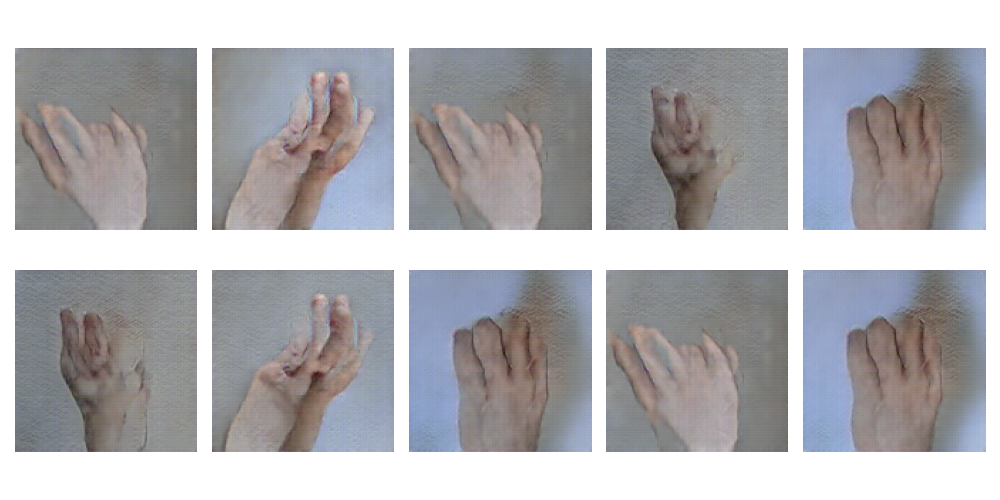
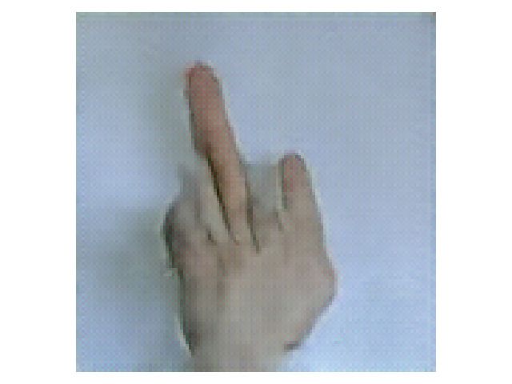

# hand-gesture-image-generation

[](https://github.com/Dawidemm/hand-gesture-image-generation/actions/workflows/tests.yaml)

## Description
This project is part of the coursework for the Computational Intelligence course within the Master's program in Automation and Robotics at the AGH University of Krakow. The project aims to investigate the influence of classifier training on real-world data versus data generated by a Generative Adversarial Network (GAN), as well as on shuffled data.

## Installation

1. Clone the repository:

    ```bash
    git clone https://github.com/Dawidemm/hand-gesture-image-generation
    cd hand-gesture-image-generation
    ```

2. Python Version:

   This project is developed using Python version 3.10.13.

3. Virtual Environment:

   It is recommended to use a virtual environment to manage dependencies and isolate the project environment.

4. Install the project:

    After activating the virtual environment, navigate to the project directory and install the project using the following command:

    ```bash
    pip install .
    ```
### Open in Lightning Studio

<a target="_blank" href="https://lightning.ai/new?repo_url=https%3A%2F%2Fgithub.com%2FDawidemm%2Fhand-gesture-image-generation">
  
</a>

Click the badge above to open this project in Lightning Studio. Please note that the studio instance opened using this link will not include the dataset. Users interested in training their own networks will need to upload their dataset.

## Data Source

The data used in this project is sourced from the "Rock-Paper-Scissors-Dataset" available on Kaggle. The dataset consists of images representing hand gestures for the rock, paper, and scissors signs. This dataset can be accessed through the following link:

[Rock Paper Scissors Dataset](https://www.kaggle.com/datasets/alexandredj/rock-paper-scissors-dataset)

The dataset is valuable for training and evaluating machine learning models for hand gesture recognition tasks. It contains a variety of hand poses and backgrounds, offering a diverse set of images for experimentation and analysis.

Additionally, some gesture images were manually removed from the dataset as they adversely affected the generated images. This step was taken to ensure the quality and accuracy of the data used for training the models.

## Summary

In this project, a series of images depicting hand gestures for the signs "rock," "paper," and "scissors" were generated. Below are examples of the generated images:



During the course of the project, the objectives were adjusted due to the quality of the generated images. Initially, the goal was to investigate the influence of classifier training on real-world data versus data generated by a Generative Adversarial Network (GAN), as well as on shuffled data. Consequently, the project focused on improving the quality and naturalness of the generated images to achieve the best results.

The training was conducted on the Lightning Studio platform using an Nvidia L4 GPU, enabling the generation of RGB images at a resolution of 128x128 pixels.

An interesting generated image is shown below, which depicts a gesture not present in the training dataset:

<p align="center">
  
</p>

## Acknowledgments

This project drew inspiration from the following sources:

- [PyTorch DCGAN Faces Tutorial](https://pytorch.org/tutorials/beginner/dcgan_faces_tutorial.html)
- [Lightning Optimization Documentation](https://lightning.ai/docs/pytorch/stable/common/optimization.html)

These tutorials provided valuable insights and techniques that were instrumental in developing this project.